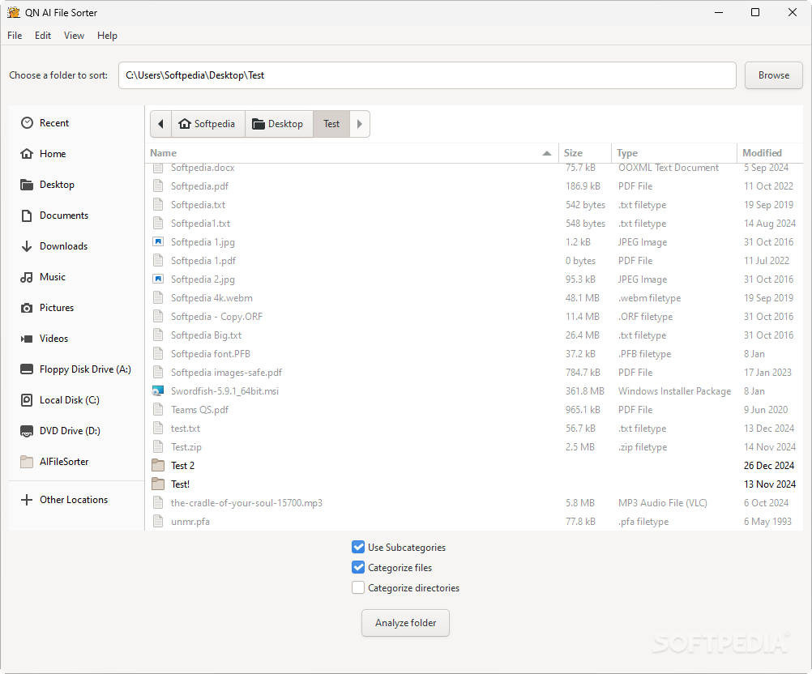
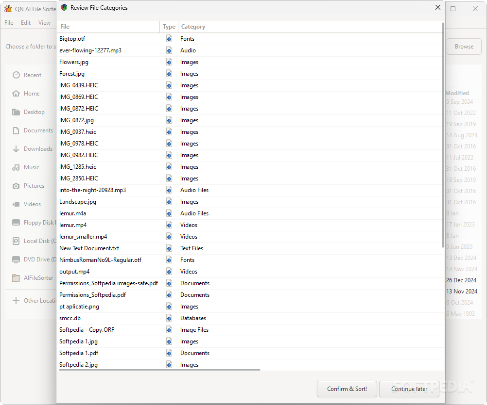
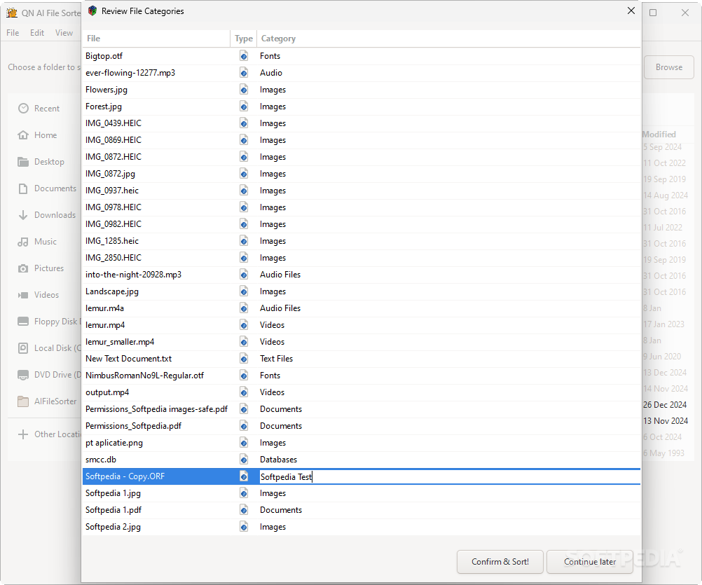
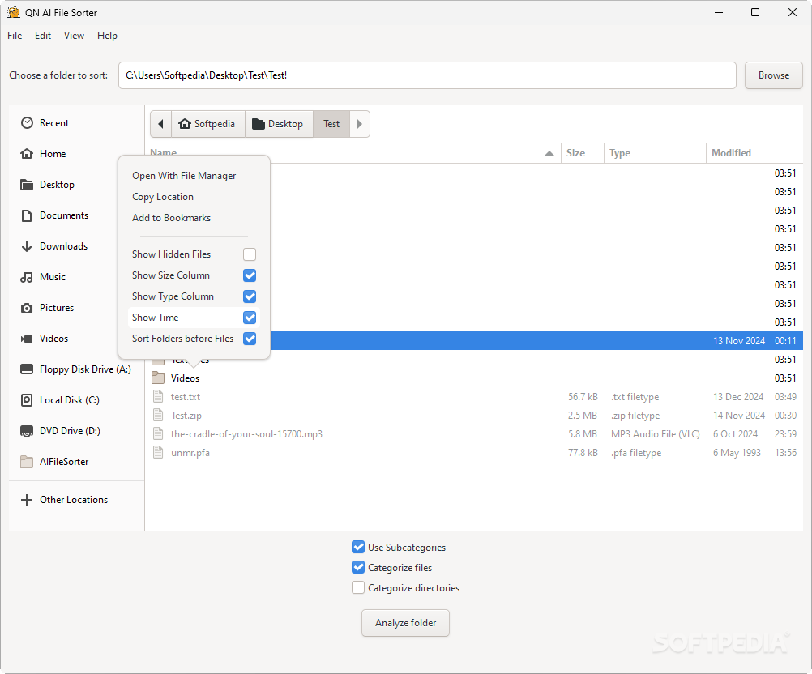

# AI File Sorter

[](#) [](https://paypal.me/aifilesorter)

AI File Sorter is a powerful, cross-platform desktop application that automates file organization. Featuring AI integration and a user-friendly GTK-based interface, it categorizes and sorts files and folders based on their names and extensions. The app intelligently assigns categories and, optionally, subcategories, which you can review and edit before confirming. Once approved, the necessary folders are created, and your files are sorted accordingly.

[](https://sourceforge.net/projects/ai-file-sorter/files/latest/download)

<a href="https://www.softpedia.com/get/File-managers/AI-File-Sorter.shtml" target="_blank">A review from Softpedia 🗗</a>

<a href="https://github.com/hyperfield/ai-file-sorter" target="_blank">App's website 🗗</a>

   

---

- [Features](#features)
- [Requirements](#requirements)
- [Installation](#installation)
  - [Windows](#windows)
  - [MacOS (Apple Silicon)](#macos-apple-silicon)
  - [Linux](#linux)
- [API Key, Obfuscation, and Encryption](#api-key-obfuscation-and-encryption)
- [Uninstallation](#uninstallation)
- [How to Use](#how-to-use)
- [Sorting a Remote Directory (e.g., NAS)](#sorting-a-remote-directory-eg-nas)  
- [Contributing](#contributing)
- [License](#license)
- [Credits](#credits)
- [Donation](#donation)

---

## Features

- **AI-Powered Categorization**: Makes use of the ChatGPT API for intelligent file classification.
- **Customizable Sorting Rules**: Automatically assigns categories and subcategories for granular organization.
- **Intuitive Interface**: Lightweight, user-friendly interface for quick and efficient use.
- **Cross-Platform Compatibility**: Available for Windows, MacOS, and Linux.
- **Local Database Caching**: Stores categorized file data to improve performance and reduce API usage costs.
- **Sorting Preview**: Review categorized files before confirming changes.
- **Secure API Key Encryption**: Protects your API key with encryption for enhanced security.
- **Update Notifications**: Notifies you of new versions, with updates being either optional or required.

---

## Requirements

- **Operating System**: Windows, macOS, or Linux with an internet connection  
- **C++ Compiler**: A recent `g++` version (used in `Makefile`)  
- **OpenAI API Key**: Required for AI-based categorization  
- **Dependencies**: Installed during setup (see installation instructions below)  

---

## Installation

Note: you will need to get an OpenAI API key and add a minimal balance to it for this program to work. The instructions on how to integrate your API key into the app are given below.

### Windows

1. Install and launch [MSYS2](https://www.msys2.org/).
2. Update MSYS2 packages: `pacman -Syu`.
3. Install the required toolchain: `pacman -S mingw-w64-x86_64-toolchain`.
4. Install dependencies:
   
```bash
pacman -S --needed mingw-w64-x86_64-gtk3 mingw-w64-x86_64-gdk-pixbuf2 mingw-w64-x86_64-glib2 mingw-w64-x86_64-curl mingw-w64-x86_64-jsoncpp mingw-w64-x86_64-sqlite3 mingw-w64-x86_64-openssl mingw-w64-x86_64-libx11 mingw-w64-x86_64-libxi mingw-w64-x86_64-libxfixes mingw-w64-x86_64-cairo mingw-w64-x86_64-atk mingw-w64-x86_64-epoxy mingw-w64-x86_64-harfbuzz mingw-w64-x86_64-fontconfig mingw-w64-x86_64-libpng mingw-w64-x86_64-libjpeg-turbo mingw-w64-x86_64-libffi mingw-w64-x86_64-pcre mingw-w64-x86_64-libnghttp2 mingw-w64-x86_64-libidn2 mingw-w64-x86_64-librtmp mingw-w64-x86_64-libssh mingw-w64-x86_64-libpsl mingw-w64-x86_64-krb5 mingw-w64-x86_64-openldap mingw-w64-x86_64-brotli mingw-w64-x86_64-libxcb mingw-w64-x86_64-libxrandr mingw-w64-x86_64-libxinerama mingw-w64-x86_64-xkbcommon mingw-w64-x86_64-wayland mingw-w64-x86_64-libthai mingw-w64-x86_64-freetype mingw-w64-x86_64-graphite2 mingw-w64-x86_64-gnutls mingw-w64-x86_64-p11-kit mingw-w64-x86_64-xz mingw-w64-x86_64-lz4 mingw-w64-x86_64-libgcrypt mingw-w64-x86_64-systemd mingw-w64-x86_64-fmt mingw-w64-x86_64-spdlog
```
5. Go to [API Key, Obfuscation, and Encryption](#api-key-obfuscation-and-encryption) and complete all steps there before proceeding to step 6 here. The app won't work otherwise.

6. Go to `app/resources` and run `./compile-resources.sh`. Go back to the `app` directory.

7. Run `make`, `make install` and `make clean`. The executable `aifilesorter.exe` will be located in `C:\Program Files\AIFileSorter`. You can add the directory to `%PATH%`.

---

### MacOS (Apple Silicon)

1. Install Xcode tools: `xcode-select --install`.
2. Install Homebrew: `/bin/bash -c "$(curl -fsSL https://raw.githubusercontent.com/Homebrew/install/HEAD/install.sh)"`.
3. Add these lines to your `~/.zshrc` file:

```
export PATH="/opt/homebrew/opt/curl/bin:$PATH"
export PATH="/usr/bin:$PATH"
export PKG_CONFIG_PATH=/opt/homebrew/lib/pkgconfig:$PKG_CONFIG_PATH
export PKG_CONFIG_PATH=/opt/homebrew/share/pkgconfig:$PKG_CONFIG_PATH
export PKG_CONFIG_PATH=/opt/homebrew/opt/libffi/lib/pkgconfig:$PKG_CONFIG_PATH
export PKG_CONFIG_PATH=/opt/homebrew/opt/expat/lib/pkgconfig:$PKG_CONFIG_PATH
export LDFLAGS="-L/opt/homebrew/opt/libffi/lib"
export CPPFLAGS="-I/opt/homebrew/opt/libffi/include"
```

Then `source ~/.zshrc` or `source ~/.bashrc`.

4. Install dependencies:
   ```bash
   brew install gcc atkmm@2.28 cairo at-spi2-core pangomm@2.46 gtk+3 gtkmm3 glibmm@2.66 cairomm@1.14 pango harfbuzz glib gettext curl jsoncpp sqlite3 openssl@3 pkg-config libffi expat xproto xorgproto fmt spdlog adwaita-icon-theme hicolor-icon-theme

   brew install --cask font-0xproto
   ```

5. Go to [API Key, Obfuscation, and Encryption](#api-key-obfuscation-and-encryption) and complete all steps there before proceeding to step 6 here. The app won't work otherwise.

6. Go to `app/resources` and run `./compile-resources.sh`. Go back to the `app` directory.

7. Run `make`, `sudo make install`, `make clean`. Then you can launch the app with the command `aifilesorter`.

---

### Linux

#### 1. Install dependencies:

##### Debian / Ubuntu:

```bash
sudo apt update && sudo apt install -y build-essential libgtk-3-dev libgdk-pixbuf2.0-dev libglib2.0-dev libcurl4-openssl-dev libjsoncpp-dev libsqlite3-dev libssl-dev libx11-dev libxi-dev libxfixes-dev libcairo2-dev libatk1.0-dev libepoxy-dev libharfbuzz-dev libfontconfig1-dev libfmt-dev libspdlog-dev libpng-dev libjpeg-dev libffi-dev libpcre3-dev libnghttp2-dev libidn2-0-dev librtmp-dev libssh-dev libpsl-dev libkrb5-dev libldap2-dev libbrotli-dev libxcb1-dev libxrandr-dev libxinerama-dev libxkbcommon-dev libwayland-dev libthai-dev libfreetype6-dev libgraphite2-dev libgnutls28-dev libp11-kit-dev liblzma-dev liblz4-dev libgcrypt20-dev libsystemd-dev
```

##### Fedora / RedHat:

```bash
sudo dnf install -y gcc-c++  gtk3-devel gdk-pixbuf2-devel glib2-devel libcurl-devel jsoncpp-devel sqlite-devel openssl-devel libX11-devel libXi-devel libXfixes-devel cairo-devel atk-devel epoxy-devel harfbuzz-devel fontconfig-devel libpng-devel libjpeg-turbo-devel libffi-devel pcre-devel libnghttp2-devel libidn2-devel librtmp-devel libssh-devel libpsl-devel krb5-devel openldap-devel brotli-devel libxcb-devel libXrandr-devel libXinerama-devel xkbcommon-devel wayland-devel libthai-devel freetype-devel graphite2-devel gnutls-devel p11-kit-devel xz-devel lz4-devel libgcrypt-devel systemd-devel fmt-devel spdlog-devel
```

##### Arch / Manjaro:

```bash
sudo pacman -Syu --needed gcc gtk3 gdk-pixbuf2 glib2 curl jsoncpp sqlite openssl libx11 libxi libxfixes cairo atk epoxy harfbuzz fontconfig libpng libjpeg-turbo libffi pcre libnghttp2 libidn2 librtmp0 libssh libpsl krb5 openldap brotli libxcb libxrandr libxinerama xkbcommon wayland libthai freetype2 graphite gnutls p11-kit xz lz4 libgcrypt systemd fmt spdlog
```

2. Go to [API Key, Obfuscation, and Encryption](#api-key-obfuscation-and-encryption) and complete all steps there before proceeding to step 6 here. The app won't work otherwise.

3. Go to `app/resources` and run `./compile-resources.sh`. Go back to the `app` directory.

4. Run `make`, `sudo make install`, `make clean`. Then you can launch the app with the command `aifilesorter`.

---

## API Key, Obfuscation, and Encryption

Before compiling the app:

1. Get an OpenAI API key from the [OpenAI website](https://platform.openai.com/).  
   A minimal balance is required in your OpenAI API account for the app to function.

2. Generate a 32-byte random secret key, e.g., using [this tool](https://generate-random.org/encryption-key-generator).

3. Navigate to the `api-key-encryption` folder and edit the `encryption.ini` as follows:

    ```
    LLM_API_KEY=sk-...
    SECRET_KEY=your-generated-32-byte-secret-key
    ```

4. Run the `compile.sh` script in the same directory to generate the executable `obfuscate_encrypt`.

5. Execute `obfuscate_encrypt` to generate:
   - Obfuscated Key part 1
   - Obfuscated Key part 2
   - Encrypted data (hex)

6. Update the application files:
   - Add the values to `resources/.env` as shown:
     ```
     ENV_PC=obfuscated-key-part1-value
     ENV_RR=encrypted-data-hex-value
     ```
   - Update `CryptoManager.cpp` with Obfuscated Key part 2:
     ```cpp
     std::string CryptoManager::embedded_pc = "obfuscated-key-part2-value";
     ```

---


## Uninstallation

In the directory `app`, run `sudo make uninstall`.

---

## How to Use

1. Launch the application (see the last step in [Installation](#installation) according your OS).
2. Select a directory to analyze.
3. Tick off the checkboxes on the main window according to your preferences.
4. Click the **"Analyze"** button. The app will scan each file and/or directory based on your selected options.
5. A review dialog will appear. Verify the assigned categories (and subcategories, if enabled in step 3).
6. Click **"Confirm & Sort!"** to move the files, or **"Continue Later"** to postpone. You can always resume where you left off since categorization results are saved.

---

## Sorting a Remote Directory (e.g., NAS)

Follow the steps in [How to Use](#how-to-use), but modify **step 2** as follows:  

- **Windows:** Assign a drive letter (e.g., `Z:` or `X:`) to your network share ([instructions here](https://support.microsoft.com/en-us/windows/map-a-network-drive-in-windows-29ce55d1-34e3-a7e2-4801-131475f9557d)).  
- **Linux & macOS:** Mount the network share to a local folder using a command like:  
  ```sh
  sudo mount -t cifs //192.168.1.100/shared_folder /mnt/nas -o username=myuser,password=mypass,uid=$(id -u),gid=$(id -g)
  ```

(Replace 192.168.1.100/shared_folder with your actual network location path and adjust options as needed.)

---

## Contributing

- Fork the repository and submit pull requests.
- Report issues or suggest features on the GitHub issue tracker.
- Follow the existing code style and documentation format.

---

## Credits

- Curl: https://github.com/curl/curl
- Gtk+3: https://gitlab.gnome.org/GNOME/gtk
- Dotenv: https://github.com/motdotla/dotenv
- JSONCPP: https://github.com/open-source-parsers/jsoncpp
- OpenAI: https://platform.openai.com/docs/overview
- OpenSSL: https://github.com/openssl/openssl
- SoftPedia: https://www.softpedia.com/get/File-managers/AI-File-Sorter.shtml
- spdlog: https://github.com/gabime/spdlog

## License

This project is licensed under the GNU AFFERO GENERAL PUBLIC LICENSE (GNU AGPL). See the [LICENSE](LICENSE) file for details.

---

## Donation

Support the development of **AI File Sorter** and its future features. Every contribution counts!

- **[Donate via PayPal](https://paypal.me/aifilesorter)**
- **Bitcoin**: 12H8VvRG9PGyHoBzbYxVGcu8PaLL6pc3NM
- **Ethereum**: 0x09c6918160e2AA2b57BfD40BCF2A4BD61B38B2F9
- **Tron**: TGPr8b5RxC5JEaZXkzeGVxq7hExEAi7Yaj

USDT is also accepted in Ethereum and Tron chains.

---